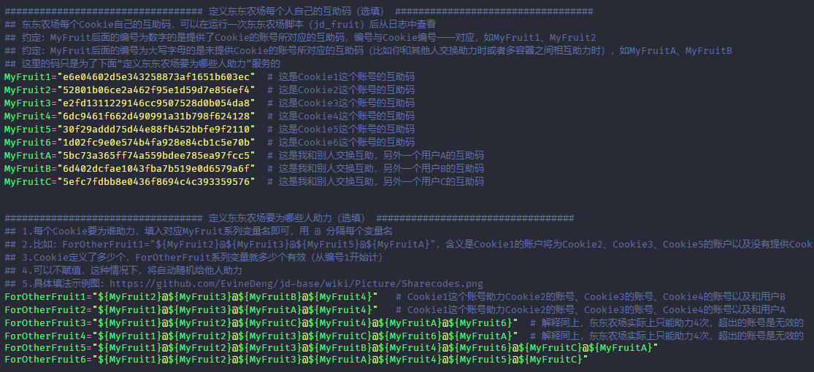

## 配置文件

### 助力次数

| 游戏 | 可助力他人次数 | 需要被助力次数 | 备注 |
| --- | :------------: | :-------: | --- |
| 东东农场 | 3                  | 5              |                                |
| 种豆得豆 | 3                  | 9              |                                |
| 东东萌宠 | 5                  | 5              |                                |
| 京喜工厂 | 3                  | 8+             | 需要被助力次数随等级提升而增加 |
| 东东工厂 | 3                  | 5              |                                |
| 京东赚赚 | 2                  | 5              |                                |
| 疯狂的JOY | 未知，请知道者补充 | 6              |                                |
| 京喜农场 | 3                  | 无上限         |                                |
| 口袋书店 | 未知，请知道者补充 | 10             |                                |
| 签到领现金 | 3                  | 40             |                                |
| 全民炸年兽 | 5                  | 10             |                                |
| 神仙书院   | 5                  | 20             |                                |
| 闪购抽盲盒 | 5                  | 10             |                                |
| 京东手机年终奖 | 5              | 5              |  活动截止 2021-02-08 23:59:59   |

### 互助码填法

**互助码是填在My系列变量中的，ForOther系统变量中只要填入My系列的变量名即可，按注释中的例子拼接，以东东农场为例，如下所示。**

**实际上东东农场一个账号只能给别人助力3次，我多写的话，只有前几个会被助力。但如果前面的账号获得的助力次数已经达到上限了，那么还是会尝试继续给余下的账号助力，所以多填也是有意义的。**

**ForOther系列变量必须从1开始编号，依次编下去。**

```shell
################################## 定义东东农场互助（选填） ##################################
MyFruit1="e6e04602d5e343258873af1651b603ec"  # 这是Cookie1这个账号的互助码
MyFruit2="52801b06ce2a462f95e1d59d7e856ef4"  # 这是Cookie2这个账号的互助码
MyFruit3="e2fd1311229146cc9507528d0b054da8"  # 这是Cookie3这个账号的互助码
MyFruit4="6dc9461f662d490991a31b798f624128"  # 这是Cookie4这个账号的互助码
MyFruit5="30f29addd75d44e88fb452bbfe9f2110"  # 这是Cookie5这个账号的互助码
MyFruit6="1d02fc9e0e574b4fa928e84cb1c5e70b"  # 这是Cookie6这个账号的互助码
MyFruitA="5bc73a365ff74a559bdee785ea97fcc5"  # 这是我和别人交换互助，另外一个用户A的互助码
MyFruitB="6d402dcfae1043fba7b519e0d6579a6f"  # 这是我和别人交换互助，另外一个用户B的互助码
MyFruitC="5efc7fdbb8e0436f8694c4c393359576"  # 这是我和别人交换互助，另外一个用户C的互助码

ForOtherFruit1="${MyFruit2}@${MyFruitB}@${MyFruit4}"   # Cookie1这个账号助力Cookie2的账号的账号、Cookie4的账号以及用户B
ForOtherFruit2="${MyFruit1}@${MyFruitA}@${MyFruit4}"   # Cookie2这个账号助力Cookie1的账号的账号、Cookie4的账号以及用户A
ForOtherFruit3="${MyFruit1}@${MyFruit2}@${MyFruitC}@${MyFruit4}@${MyFruitA}@${MyFruit6}"  # 解释同上，东东农场实际上只能助力3次
ForOtherFruit4="${MyFruit1}@${MyFruit2}@${MyFruit3}@${MyFruitC}@${MyFruit6}@${MyFruitA}"  # 解释同上，东东农场实际上只能助力3次
ForOtherFruit5="${MyFruit1}@${MyFruit2}@${MyFruit3}@${MyFruitB}@${MyFruit4}@${MyFruit6}@${MyFruitC}@${MyFruitA}"
ForOtherFruit6="${MyFruit1}@${MyFruit2}@${MyFruit3}@${MyFruitA}@${MyFruit4}@${MyFruit5}@${MyFruitC}"
```



### 如何控制不同时间赋不同的值

```shell
## 时间
$(date "+%d") # 当前的日期，如：13
$(date "+%w") # 当前是星期几，如：3
$(date "+%H") # 当前的小时数，如：23
$(date "+%M") # 当前的分钟数，如：49

## 两个数字比较
-eq  # 前后两个数字相等
-ne  # 前后两个数字不等
-lt  # 前面数字小于后面数字
-le  # 前面数字小于或等于后面数字
-gt  # 前面数字大于后面数字
-ge  # 前面数字大于或等于后面数字
```

在config.sh.sample中其实已经给出过一个例子了，就是控制`东东萌宠是否静默运行`这个变量`PET_NOTIFY_CONTROL`，示例如下：

```shell
if [ $(date "+%w") -eq 6 ] && [ $(date "+%H") -ge 9 ] && [ $(date "+%H") -lt 14 ]; then    # 如果当前是周六，当前小时数大于等于9并且小于14，则让东东萌宠发通知
  export PET_NOTIFY_CONTROL="false"
elif [ $(date "+%w") -eq 3 ] && [ $(date "+%H") -ge 9 ] && [ $(date "+%H") -lt 14 ]; then  # 如果当前是周三，当前小时数大于等于9并且小于14，则让东东萌宠发通知
  export PET_NOTIFY_CONTROL="false"
else
  export PET_NOTIFY_CONTROL="true"    # 其他非上述时间段时，通通不发通知
fi
```

在这里再额外给一些不同时间赋不同的具体例子：

1. 比如点点券（jd_necklace）的cron为`20 0,20 * * *`，每天0:20和20:20各运行一次，运行一次会发通知，但又不想收到通知，则可以在这两个时间点取消通知TOKEN的赋值（以钉钉为例）：


```shell
if [ $(date "+%H") -eq 0 ] && [ $(date "+%M") -eq 20 ]; then      # 点点券
  export DD_BOT_TOKEN=""
  export DD_BOT_SECRET=""
elif [ $(date "+%H") -eq 20 ] && [ $(date "+%M") -eq 20 ]; then   # 点点券
  export DD_BOT_TOKEN=""
  export DD_BOT_SECRET=""
else
  export DD_BOT_TOKEN="f8af60daa6a8ac99XXXXXXXXXXXXXXXXXXXXa07dbe10b4dbe324377bc"
  export DD_BOT_SECRET="SEC08db895aXXXXXXXXXX3acaeab76736e16cXXXXXXXXXX3412a4f36942aa905f76"
fi
```

2. 又比如想在报名宠汪汪赛跑时，调整Cookie顺序，让后面的账号先报名，前面的账号后报名，假如报名这一次的cron时间为10:02，则可以：

```shell
if [ $(date "+%H") -eq 10 ] && [ $(date "+%M") -eq 2 ]
then  # 每天10：02报名宠汪汪赛跑时调整顺序
  Cookie8="pt_key=AAAAAAAAAAAAAAAAAAAAAAAAAAAAAAAAAAAAAAAAAAAAAAAAAAAAAAAAAAAAAAAAAAAAAAAAAAA;pt_pin=XXXXXXXX;"
  Cookie7="pt_key=BBBBBBBBBBBBBBBBBBBBBBBBBBBBBBBBBBBBBBBBBBBBBBBBBBBBBBBBBBBBBBBBBBBBBBBBBBB;pt_pin=XXXXXXXX;"
  Cookie5="pt_key=CCCCCCCCCCCCCCCCCCCCCCCCCCCCCCCCCCCCCCCCCCCCCCCCCCCCCCCCCCCCCCCCCCCCCCCCCCC;pt_pin=XXXXXXXX;"
  Cookie6="pt_key=DDDDDDDDDDDDDDDDDDDDDDDDDDDDDDDDDDDDDDDDDDDDDDDDDDDDDDDDDDDDDDDDDDDDDDDDDDD;pt_pin=XXXXXXXX;"
  Cookie1="pt_key=EEEEEEEEEEEEEEEEEEEEEEEEEEEEEEEEEEEEEEEEEEEEEEEEEEEEEEEEEEEEEEEEEEEEEEEEEEE;pt_pin=XXXXXXXX;"
  Cookie2="pt_key=FFFFFFFFFFFFFFFFFFFFFFFFFFFFFFFFFFFFFFFFFFFFFFFFFFFFFFFFFFFFFFFFFFFFFFFFFFF;pt_pin=XXXXXXXX;"
  Cookie3="pt_key=GGGGGGGGGGGGGGGGGGGGGGGGGGGGGGGGGGGGGGGGGGGGGGGGGGGGGGGGGGGGGGGGGGGGGGGGGGG;pt_pin=XXXXXXXX;"
  Cookie4="pt_key=HHHHHHHHHHHHHHHHHHHHHHHHHHHHHHHHHHHHHHHHHHHHHHHHHHHHHHHHHHHHHHHHHHHHHHHHHHH;pt_pin=XXXXXXXX;"
else
  Cookie1="pt_key=AAAAAAAAAAAAAAAAAAAAAAAAAAAAAAAAAAAAAAAAAAAAAAAAAAAAAAAAAAAAAAAAAAAAAAAAAAA;pt_pin=XXXXXXXX;"
  Cookie2="pt_key=BBBBBBBBBBBBBBBBBBBBBBBBBBBBBBBBBBBBBBBBBBBBBBBBBBBBBBBBBBBBBBBBBBBBBBBBBBB;pt_pin=XXXXXXXX;"
  Cookie3="pt_key=CCCCCCCCCCCCCCCCCCCCCCCCCCCCCCCCCCCCCCCCCCCCCCCCCCCCCCCCCCCCCCCCCCCCCCCCCCC;pt_pin=XXXXXXXX;"
  Cookie4="pt_key=DDDDDDDDDDDDDDDDDDDDDDDDDDDDDDDDDDDDDDDDDDDDDDDDDDDDDDDDDDDDDDDDDDDDDDDDDDD;pt_pin=XXXXXXXX;"
  Cookie5="pt_key=EEEEEEEEEEEEEEEEEEEEEEEEEEEEEEEEEEEEEEEEEEEEEEEEEEEEEEEEEEEEEEEEEEEEEEEEEEE;pt_pin=XXXXXXXX;"
  Cookie6="pt_key=FFFFFFFFFFFFFFFFFFFFFFFFFFFFFFFFFFFFFFFFFFFFFFFFFFFFFFFFFFFFFFFFFFFFFFFFFFF;pt_pin=XXXXXXXX;"
  Cookie7="pt_key=GGGGGGGGGGGGGGGGGGGGGGGGGGGGGGGGGGGGGGGGGGGGGGGGGGGGGGGGGGGGGGGGGGGGGGGGGGG;pt_pin=XXXXXXXX;"
  Cookie8="pt_key=HHHHHHHHHHHHHHHHHHHHHHHHHHHHHHHHHHHHHHHHHHHHHHHHHHHHHHHHHHHHHHHHHHHHHHHHHHH;pt_pin=XXXXXXXX;"
fi
```
    
## 日志相关

1. 日志报类似以下错误：
    ```
    TypeError: (intermediate value)(...).catch(...).finally is not a function
    at Object. (/home/bobotoy/jd/scripts/jd_bean_sign.js:52:13)
    at Module._compile (module.js:652:30)
    at Object.Module._extensions..js (module.js:663:10)
    at Module.load (module.js:565:32)
    at tryModuleLoad (module.js:505:12)
    at Function.Module._load (module.js:497:3)
    at Function.Module.runMain (module.js:693:10)
    at startup (bootstrap_node.js:188:16)
    at bootstrap_node.js:609:3
    ```
    首先，需要保证Node.js大版本>=10，其次，在>=10的某些小版本也有此问题（你可以使用`node -v`或`nodejs -v`查看Node.js的版本），问题及详细的解决措施见[nodejs/help#1877](https://github.com/nodejs/help/issues/1877)。

2. 日志报类似以下错误：
    ```
    (node:191) UnhandledPromiseRejectionWarning: Error: Cannot find module 'got'
    Require stack:
    - /jd/scripts/jd_bean_change.js
      at Function.Module._resolveFilename (internal/modules/cjs/loader.js:880:15)
      at Function.Module._load (internal/modules/cjs/loader.js:725:27)
      at Module.require (internal/modules/cjs/loader.js:952:19)
      at require (internal/modules/cjs/helpers.js:88:18)
      at Object.initGotEnv (/jd/scripts/jd_bean_change.js:266:3667)
      at Object.post (/jd/scripts/jd_bean_change.js:266:5580)
      at /jd/scripts/jd_bean_change.js:150:7
      at new Promise (<anonymous>)
      at TotalBean (/jd/scripts/jd_bean_change.js:136:10)
      at /jd/scripts/jd_bean_change.js:61:13
      (Use `node --trace-warnings ...` to show where the warning was created)
      (node:191) UnhandledPromiseRejectionWarning: Unhandled promise rejection. This error originated either by throwing inside of an async function without a catch block, or by rejecting a promise which was not handled with .catch(). To terminate the node process on unhandled promise rejection, use the CLI flag `--unhandled-rejections=strict` (see https://nodejs.org/api/cli.html#cli_unhandled_rejections_mode). (rejection id: 1)
      (node:191) [DEP0018] DeprecationWarning: Unhandled promise rejections are deprecated. In the future, promise rejections that are not handled will terminate the Node.js process with a non-zero exit code.
    ```

    如果是Docker，请运行`docker exec -it jd bash git_pull`，仔细看输出日志，可运行多次直到不报错为止。

    如果是非Docker，cd到本仓库脚本目录后执行`bash git_pull.sh`，仔细看输出日志，可运行多次直到不报错为止。

3. 日志能产生但一直是空的，两个解决办法：

    - 放弃使用CentOS；

    - 回小学重新学习语文知识，学好再来仔细地读一遍crontab.list中的注释。

    请搞明白PATH的含义：[一文精通crontab](https://zhuanlan.zhihu.com/p/58719487)，重点阅读这一篇文章的“环境变量问题”这一章节，出现日志能产生但一直是空的这个问题绝对是PATH有问题导致的，请将这篇文件理解透后，再来更改你crontab.list的PATH。注意：PATH中，前面的路径比后面的路径优先级更高。