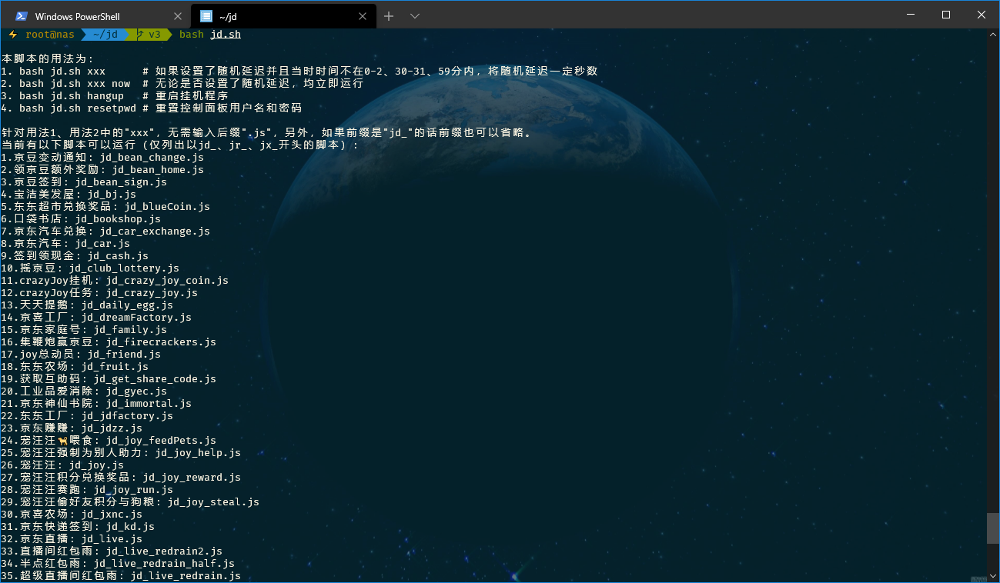
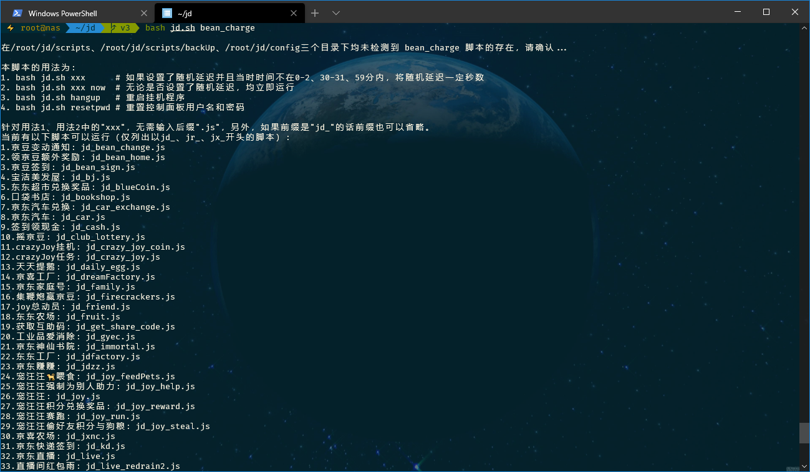

## 脚本可以干什么

### git_pull.sh

1. 自动更新lxk0301的京东薅羊毛脚本；

2. 自动更新我的shell脚本；

3. 自动删除失效的定时任务，并发送通知；

4. 自动添加新的定时任务，并发送通知；

5. 检测配置文件模板`config.sh.sample`是否升版，如有升版，发出通知；

6. 其他还有若干功能，查看 [本文件](https://github.com/EvineDeng/jd-base/blob/v3/git_pull.sh) 注释即可看到。

### export_sharecodes.sh

从已经产生的日志中导出互助码，注意：是已经产生的日志。

### rm_log.sh

自动按设定天数（config.sh中设置的）删除旧日志。

### jd.sh

自动按crontab.list设定的时间去跑各个薅羊毛脚本，需要后本脚本后面提供js脚本名称。

## 准备环境

1. 在[Node.js官网](https://nodejs.org/zh-cn/download)下载并安装Node.js长期支持版（已包括npm）；

2. 安装git、wget、curl、perl、moreutils，可能某个软件已经集成在系统中。

## 流程

**以下全文均以此路径`/user/用户名/jd`进行举例，请自行修改为你自己的路径！**

**以下全文均以此路径`/user/用户名/jd`进行举例，请自行修改为你自己的路径！**

**以下全文均以此路径`/user/用户名/jd`进行举例，请自行修改为你自己的路径！**

**注意：不支持多账号并发。想要方便简单使用多账号并发的，请使用Docker的方式。**

1. 克隆本仓库

    如需以后从Github更新我的和lxk0301大佬的脚本：

    ```shell
    git clone -b v3 https://github.com/EvineDeng/jd-base /user/用户名/jd
    ```

    如需以后从Gitee更新我的和lxk0301大佬的脚本：

    ```shell
    git clone -b v3 https://gitee.com/evine/jd-base /user/用户名/jd
    ```

2. 复制并编辑自己的配置文件

    ```
    cd /user/用户名/jd

    # 创建一个配置文件保存目录
    mkdir config

    # 复制仓库下sample/config.sh.sample到config目录中，并命名为config.sh
    cp sample/config.sh.sample config/config.sh

    # 复制仓库下sample/computer.list.sample到config目录中，并命名为crontab.list
    cp sample/computer.list.sample config/crontab.list
    ```
    
    可以通过控制面板编辑，详见 [控制面板使用教程](Panel) ，也可以本地编辑。

    其中`config.sh`是配置文件，`crontab.list`是定时任务清单。编辑这两个文件，如何编辑请查看两个文件内的注释。
    
    > 关于`crontab.list`，这里说明一下，除了那些本来就会准时运行的脚本外，如果还有一些脚本你不想随机延迟，要么在`config.sh`中`RandomDelay`不要赋值(所有任务都将不延迟执行)，要么参考下面 [如何手动运行脚本](MacOS#如何手动运行脚本) 部分，在`crontab.list`中不想被随机延迟运行的任务后面，添加上 `now`，比如：
    
    ```shell
    20 * * * * bash /user/用户名/jd/jd.sh jd_dreamFactory now
    ```

3. 初始化

    **在首次编辑好`config.sh`和`crontab.list`后，请务必手动运行一次`git_pull.sh`，不仅是为检查错误，也是为了运行一次`npm install`用以安装js指定的依赖。**

    ```shell
    bash git_pull.sh
    ```

    **针对首次运行`git_pull.sh`**，出现类似以下字样才表示`npm install`运行成功：
    ```
    audited 205 packages in 3.784s

    11 packages are looking for funding
    run `npm fund` for details

    found 0 vulnerabilities
    ```

    如果`npm install`失败，请尝试手动运行，可按如下操作，如果失败，可运行多次：

    ```shell
    cd /user/用户名/jd/scripts
    npm install || npm install --registry=https://registry.npm.taobao.org
    ```

4. 添加定时任务

    **请注意：以下命令会完整覆盖你当前用户的crontab清单，请务必先检查当前用户是否存在其他定时任务！！！**

    **请注意：以下命令会完整覆盖你当前用户的crontab清单，请务必先检查当前用户是否存在其他定时任务！！！**

    **请注意：以下命令会完整覆盖你当前用户的crontab清单，请务必先检查当前用户是否存在其他定时任务！！！**

    > **你可以先使用`crontab -l`命令检查当前用户的定时任务清单，如果有，请将这部分任务放在下面这个`crontab.list`文件中指定的位置（注意看注释的说明），然后再运行下面的命令，这样你原来的定时任务也就保留了。**
    
    > **如果以后你还要增加其他定时任务，也请加在这个文件最上方以后，再运行下面命令。如果不添加在这个文件中，那么脚本会以crontab.list中的清单覆盖掉你通过其他方式添加的定时任务。**

    ```shell
    cd /user/用户名/jd
    crontab config/crontab.list
    ```

5. 部署完成。

## 如何更新配置文件

`config.sh`和`crontab.list`两个文件都一样，在任何时候改完保存好就行，其他啥也不用干，改完以后，新的任务就以新配置运行了。其中`config.sh`改完立即生效，`crontab.list`会在下一次任何定时薅羊毛任务启动时更新。

如需要在线比对编辑，请参考：[控制面板使用教程](Panel)

## 如何添加其他脚本

本环境基于node，所以也只能跑js脚本。你可以把你的后缀为`.js`的脚本放在`/user/用户名/jd/scripts`下。比如你放了个`test.js`，可以在你的`crontab.list`中添加如下的定时任务：

```shell
15 10 * * * bash /user/用户名/jd/jd.sh test     # 如果不需要准时运行或RandemDelay未设置
15 10 * * * bash /user/用户名/jd/jd.sh test now # 如果设置了RandemDelay但又需要它准时运行
```

然后运行一下`crontab /user/用户名/jd/config/crontab.list`更新定时任务即可。

**注意：在crontab.list中，你额外添加的任务不能以“jd_”、“jr_”、“jx_”开头，以“jd_”、“jr_”、“jx_”开头的任务如果不在[https://github.com/LXK9301/jd_scripts](https://github.com/LXK9301/jd_scripts) 和 [https://github.com/shylocks/Loon](https://github.com/shylocks/Loon) 这两个仓库中，那么这个任务会被删除。**

如果你额外加的脚本要用到环境变量，直接在你的`config.sh`文件最下方按以下形式添加好变量即可（单引号或双引号均可）：

```shell
export 变量名1="变量值1"
export 变量名2="变量值2"
export 变量名3="变量值3"
```

## 如何手动运行脚本

1. 手动 git pull 更新脚本

    ```shell
    cd /user/用户名/jd
    bash git_pull.sh
    ```

2. 手动删除指定时间以前的旧日志

    ```shell
    cd /user/用户名/jd
    bash rm_log.sh
    ```

3. 手动导出所有互助码

    ```shell
    cd /user/用户名/jd
    bash export_sharecodes.sh
    ```

4. 手动启动挂机程序

    `cd`到脚本目录后输入`bash jd.sh hangup`即可，然后挂机脚本就会一直运行。如果你希望每天终止旧的挂机进程，然后启动新的挂机进程，请参考`sample/termux.list.sample`中的挂机定时任务，添加到自己的`crontab.list`中。目前仅一个`jd_crazy_joy_coin.js`为挂机脚本。

5. 手动执行薅羊毛脚本，用法如下(其中`xxx`为lxk0301大佬的脚本名称)，不支持直接以`node xxx.js`命令运行：

    ```
    cd /user/用户名/jd
    bash jd.sh xxx      # 如果设置了随机延迟并且当时时间不在0-2、30-31、59分内，将随机延迟一定秒数
    bash jd.sh xxx now  # 无论是否设置了随机延迟，均立即运行
    ```

    如果你没输lxk0301大佬的脚本名称也不要紧，`jd.sh`会提示你：

    

    如果lxk0301脚本名不记得也不要紧，输错了也会提示你的：

    

## 如有帮助你薅到羊毛，请不吝赏杯茶水费


